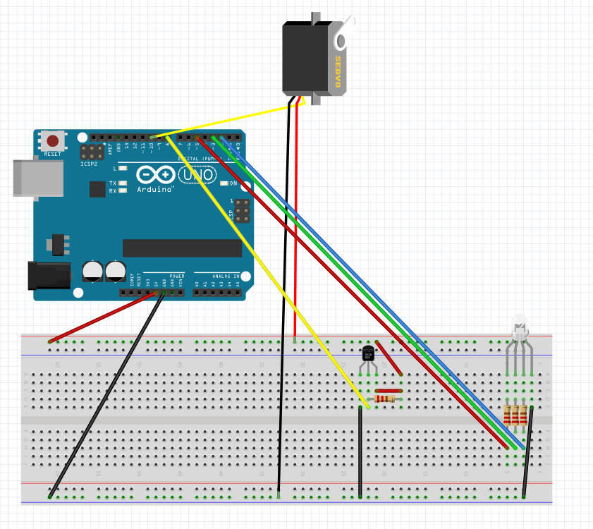

# TIW8 - IOT : Projet Tea-diver

Groupe :
- GIL Jérôme => 11608911
- ICMEN Malik => 11704010
- TRÉMÉ Guillaume => 11507711
- VIGLIANO Léa => 11517348

## Idée de base : Tea Diver

On souhaite réaliser un contrôleur d'infusion d'une tasse de thé. On indique quel thé on souhaite infuser, une API va 
chercher les informations concernant son infusion, puis l'arduino va effectuer des contrôles. Il va vérifier la
si l'eau est à la bonne température, et va indiquer si elle est trop chaude ou trop froide.
A l'aide d'un moteur rotatif, l'arduino est capable de descendre et monter le sachet, pour démarrer et arrêter
l'infusion, mais aussi pour secouer le sachet pendant l'infusion pour qu'elle soit plus efficace.

## Cahier des charges

### Matériel nécessaire

- Arduino
- Breadboard
- Moteur rotatif Servo SM-S2039S
- Thermomètre waterproof DS18B20
- LED RGB
- Fils

### Côté logiciel

- API externe forkée de [ce projet](https://github.com/victoria-lo/TAPI), déployée sur [Heroku](https://tea-diver-tiw8.herokuapp.com), base de données sur MongoDB Atlas pour récupérer les informations sur les thés.
- Serveur : Lancement de l'application, écoute de l'arduino => Express, Johnny-Five. 
- Interface web : Choix du thé, affichage température, lancement de la préparation du thé => SPA React simple

### Besoins

Permet de gérer l'infusion d'un thé.
- Un moteur doit plonger le sachet thé dans l'eau chaude, le retirer et le secouer pendant l'infusion.
- Un capteur doit mesurer la température de l'eau pour s'assurer d'une infusion en conditions optimales.

### Contraintes

- L'utilisation d'eau implique d'utiliser des composants waterproof et de protéger ceux qui ne peuvent pas l'être
- L'eau étant chaude, il faut faire en sorte que l'eau n'éclabousse pas quand on remue le sachet.
- Le bras du moteur est court, il faut pourtant qu'il ait assez d'amplitude pour que le sachet puisse remonter suffisamment et arrêter l'infusion.

## Lancement du projet

Installation des dépendances :

```sh
yarn install
# ou
npm install
```

Build le projet :

```sh
yarn build
# ou
npm run build
```

Lancement du serveur :

```sh
yarn start
# ou
npm run start
```

Accéder à l'application à [cette adresse en local](http://localhost:3000/)

## Fonctionnement : Tea Diver

Commencer par démarrer le serveur et accéder à l'application.

Une fois que vous pouvez accéder à l'application, vous pouvez mettre votre tasse ou autre contenant rempli d'eau chaude,  accrocher vôtre thé, et selectionner le thé qui correspond au vôtre dans l'interface (peu importe l'ordre).

Le bouton de lancement ne sera pas actionnable tant que vous n'aurez pas respecté les conditions suivantes :
- Avoir sélectionné un thé
- Avoir une eau avec une température aux environs de celle conseillé par l'API.

Une fois les conditions respectées, le bouton de lancement est activé, vous pourrez alors déclencher l'infusion.

Une fois l'infusion déclenchée, la LED s'allume en rouge, elle indique que le processus d'infusion est en cours.
Le sachet de thé est alors plongé dans l'eau et secoué régulièrement.

Une fois le temps d'infusion écoulé, le sachet est remonté, la LED passe au vert et vous pourrez récupérer
votre thé.

## Montage Board


